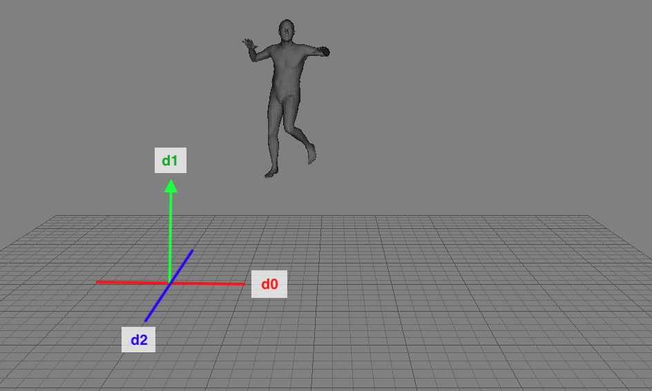

# SMPL to FBX


I can convert motions in SMPL format into FBX files.

## Steps
1. Install [Python FBX](https://download.autodesk.com/us/fbx/20112/fbx_sdk_help/index.html?url=WS1a9193826455f5ff453265c9125faa23bbb5fe8.htm,topicNumber=d0e8312).
1. Download the [SMPL fbx model](https://smpl.is.tue.mpg.de) for unity. Keep the male model `SMPL_m_unityDoubleBlends_lbs_10_scale5_207_v1.0.0.fbx`.
2. `pip install -r requirements.txt`
3. Here's the file structure:
    ```
    <root>
    |--Convert.py
    |--SmplObject.py
    |--FbxReadWriter.py
    |--<pkl_path>/
    |  |--*.pkl
    |--<fbx_path>/
    |  |--SMPL_m_unityDoubleBlends_lbs_10_scale5_207_v1.0.0.fbx
    |--<output_path>/
    ```
4. `python3 Convert.py --input_pkl_base <pkl_path> --fbx_source_path <fbx_path>/SMPL_m_unityDoubleBlends_lbs_10_scale5_207_v1.0.0.fbx --output_base <output_path>` to start converting.
## What's inside the pkl file?
A pkl file contains a dictionary with two keys: `smpl_poses` and `smpl_trans`. There's a sample pkl file in `./Pkls/sample.pkl`.
* `Dict["smpl_poses"]` : A `(N, 72)` ndarray, where `N` is the frame number.
    * Joint order: 
        ```
        0:Pelves
        1:L hip
        2:R hip"
        3:Spine1"
        4:L_Knee"
        5:R_Knee"
        6:Spine2"
        7:L_Ankle"
        8:R_Ankle"
        9:Spine3"
        10:L_Foot"
        11:R_Foot"
        12:Neck"
        13:L_Collar"
        14:R_Collar"
        15:Head"
        16:L_Shoulder"
        17:R_Shoulder"
        18:L_Elbow"
        19:R_Elbow"
        20:L_Wrist"
        21:R_Wrist"
        22:L_Hand"
        23:R_Hand"
        ```
    * `72` is from `24joints*3`; `3` is the dimension for the [rotation vector](https://en.wikipedia.org/wiki/Axis%E2%80%93angle_representation) of each joint.
* `Dict["smpl_trans"]`: A `(N, 3)` ndarray. The translation of the Pelvis in each frame.
* Basically following the [AIST++](https://google.github.io/aistplusplus_dataset/factsfigures.html) naming rule. The code is designed specifically to convert the AIST++ dance motions into fbx files.
## Appendix
### I got a translation vector `[d0, d1, d2]` of a frame. How do I assign each dimension to the correct axis?
Follow this order:

### Bones
```python
bones=[(0,1), (1,4), (4,7), (7,10), # R leg
       (0,2), (2,5), (5,8), (8,11), # L leg
       (0,3), (3,6), (6,9), # Spine
       (9,12), (12,15), # Head
       (9,13), (13,16), (16,18), (18,20), (20,22), # R arm
       (9,14), (14,17), (17,19), (19,21), (21,23)] # L arm
```
